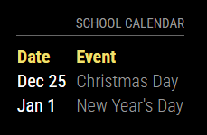

# MMM-LINQConnectCalendar

A [MagicMirror²](https://magicmirror.builders/) module to display 

## Preview



## Installing the Module

```bash
cd ~/MagicMirror/modules
git clone https://github.com/dathbe/MMM-LINQConnectCalendar
cd MMM-LINQConnectCalendar
npm install --omit=dev
```

No dependencies required!

## Updating the Module

```bash
cd ~/MagicMirror/modules/MMM-LINQConnectCalendar
git pull
npm install --omit=dev
```

## Configuration

Add MMM-LINQConnectCalendar module to the `modules` array in the `config/config.js` file. The following example config shows a minimal configuration option. More options are described below.

```javascript
{
  module: "MMM-LINQConnectCalendar",
  position: "top_right",
  config: {
    
  }
},
```

| Option           | Description
| -------          |  -------
|          | 
|         | 
| updateInterval   | Time (in seconds) between image updates.<br><br>**Type:** `int`<br> **Default value:** `15 * 60` (15 minutes)

## Contributing

If you find any problems, bugs or have questions, please [open a GitHub issue](https://github.com/dathbe/MMM-LINQConnectCalendar/issues) in this repository.

Pull requests are of course also very welcome 🙂

### Code of Conduct

Please note that this project is released with a [Contributor Code of Conduct](CODE_OF_CONDUCT.md). By participating in this project you agree to abide by its terms.

### Developer commands

You will need to first install the dev dependencies:

```bash
cd ~/MagicMirror/modules/MMM-LINQConnectCalendar
npm install
```

- `npm run lint` - Run linting checks.
- `npm run lint:fix` - Fix automatically fixable linting errors.

## License

This project is licensed under the MIT License - see the [LICENSE](LICENSE.md) file for details.
