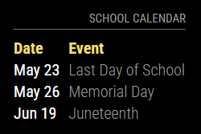

# MMM-LINQConnectCalendar

A [MagicMirror²](https://magicmirror.builders/) module to display school calendars provided by LINQConnect.

[](https://MagicMirror.builders)
[](LICENSE.md)

## Preview



## Installing the Module

```bash
cd ~/MagicMirror/modules
git clone https://github.com/dathbe/MMM-LINQConnectCalendar
cd MMM-LINQConnectCalendar
npm ci --omit=dev
```

Dependencies:
* [moment-timezone](https://www.npmjs.com/package/moment-timezone)

## Updating the Module

```bash
cd ~/MagicMirror/modules/MMM-LINQConnectCalendar
git pull
npm ci --omit=dev
```

## Configuration

Add MMM-LINQConnectCalendar module to the `modules` array in the `config/config.js` file. The following example config shows a minimal configuration option. More options are described below.

```javascript
{
  module: "MMM-LINQConnectCalendar",
  position: "top_right",
  config: {
    buildingId: '23125610-cbbc-eb11-a2cb-82fe13669c55',
    districtId: '93f76ff0-2eb7-eb11-a2c4-e816644282bd',
  }
},
```

| Option         | Description
| -------        |  -------
| buildingId     | **REQUIRED** The `buildingId` for your school. See [Finding your buildingId and districtId](https://github.com/evanhsu/MMM-TitanSchoolMealMenu?tab=readme-ov-file#finding-your-buildingid-and-districtid).<br>**Type:** `string`<br>**Default:** `''` (empty string; will throw an error)
| districtId     | **REQUIRED** The `districtId` for your school. See [Finding your buildingId and districtId](https://github.com/evanhsu/MMM-TitanSchoolMealMenu?tab=readme-ov-file#finding-your-buildingid-and-districtid).<br>**Type:** `string`<br>**Default:** `''` (empty string; will throw an error)
| noDays         | The number of upcoming days you would like to display events for.<br>**Type:** `int`<br>**Default:** `30` (will display all events for the next 30 days)
| maxEntries     | The maximum number of event entries you want to display.<br>**Type:** `int`<br>**Default:** `99` (effectively, no limit)
| dateFormat     | The format you would like to use to display the date of the event.  See [Moment.js - Home](https://momentjs.com/) for information on formatting dates.<br>**Type:** `string`<br>**Default:** `'MMM D'` (e.g., "Jan 1")
| dateHeader     | The header you would like to use for the date column.<br>**Type:** `string`<br>**Default:** `'Date'`
| eventHeader    | The header you would like to use for the event column.<br>**Type:** `string`<br>**Default:** `'Event'`
| updateInterval | Time (in minutes) between calendar updates.<br><br>**Type:** `int`<br> **Default value:** `4 * 60` (4 hours)

## Contributing

If you find any problems, bugs or have questions, please [open a GitHub issue](https://github.com/dathbe/MMM-LINQConnectCalendar/issues) in this repository.

Pull requests are of course also very welcome 🙂

### Code of Conduct

Please note that this project is released with a [Contributor Code of Conduct](CODE_OF_CONDUCT.md). By participating in this project you agree to abide by its terms.

### Developer commands

You will need to first install the dev dependencies:

```bash
cd ~/MagicMirror/modules/MMM-LINQConnectCalendar
npm install
```

- `node --run lint` - Run linting checks.
- `node --run lint:fix` - Fix automatically fixable linting errors.

## License

This project is licensed under the MIT License - see the [LICENSE](LICENSE.md) file for details.
